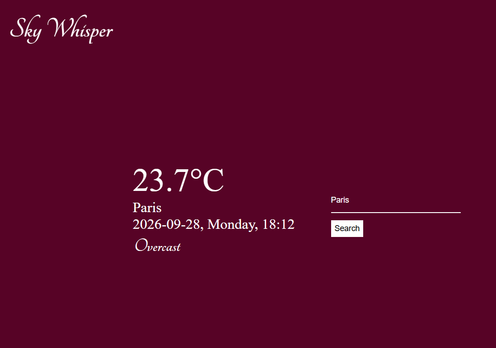

# Weather Application

A responsive weather application that allows users to search for a city and view its current weather conditions in real time.

## Preview



## 🌐 Live Demo

[View the Live Weather App](https://neyethedevanalyst.github.io/Weather-App/)

## Features

* Search for weather by city
* Display current temperature and weather condition
* Display location and local date/time
* Responsive design for mobile and desktop
* Live weather data from WeatherAPI
* Secure API key handling through a backend

## Technologies

**Frontend**

* HTML5
* CSS3
* JavaScript

**Backend**

* Node.js
* Express.js
* CORS
* dotenv

**API & Deployment**

* WeatherAPI.com
* GitHub Pages
* Render

## How It Works

The frontend sends the searched city to the Express backend:

```text
User → GitHub Pages → Express Backend → WeatherAPI
                         ↓
                    Weather Data
                         ↓
                    GitHub Pages
```

The backend handles the WeatherAPI request and keeps the API key stored securely as an environment variable rather than exposing it in the frontend.

## What I Learned

* Working with REST APIs
* Using JavaScript `fetch()` and `async/await`
* DOM manipulation
* Building an Express.js backend
* Using environment variables
* Connecting a frontend to a backend
* Deploying a full-stack application

## Future Improvements

* Add a multi-day weather forecast
* Add weather icons
* Add geolocation
* Add temperature unit conversion
* Improve error handling

## Author

**Matilda Eyubeh**

Full Stack Developer | Data Analyst

[GitHub](github.com/NeyeTheDevAnalyst) · [LinkedIn](www.linkedin.com/in/matildaeyubeh)
